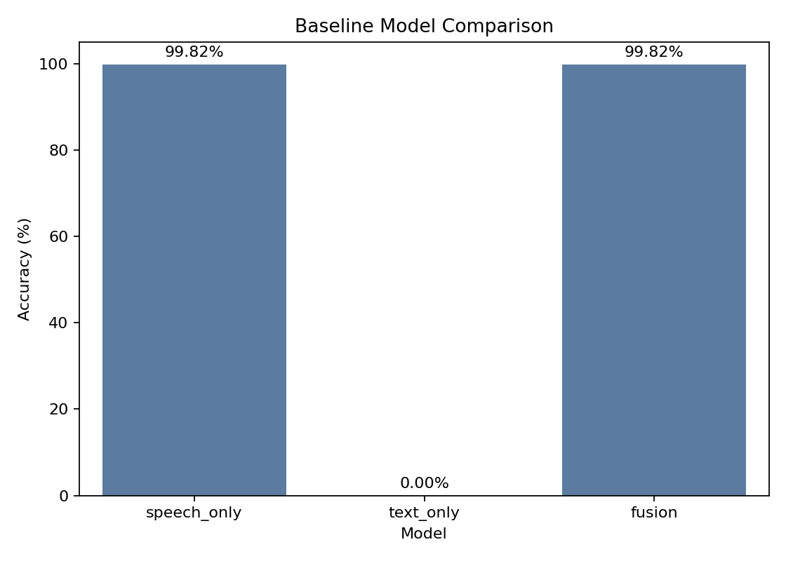
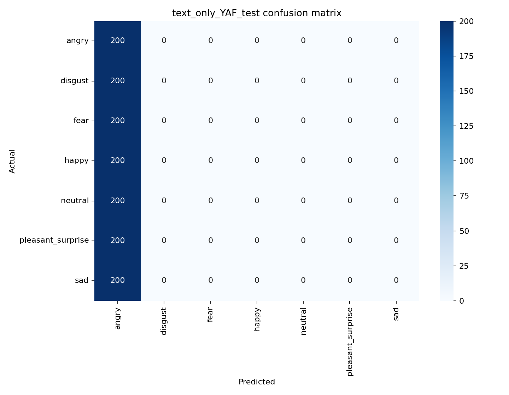
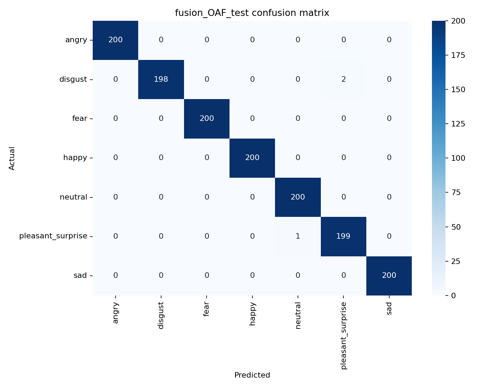

# Multimodal Emotion Recognition — Project Report
### Toronto Emotional Speech Set (TESS)

> **Render in Markdown Preview for inline figures.** In VS Code: `Ctrl+Shift+V`  
> **Repository:** https://github.com/Najoji/Multimodal-Emotion-Recognition-

---

## Overview

This report documents the design, implementation, and evaluation of a multimodal emotion recognition system built on the Toronto Emotional Speech Set (TESS). Three complete recognition systems are constructed and compared:

- **(a) Speech-only** — acoustic signal as the sole input
- **(b) Text-only** — transcript words as the sole input  
- **(c) Multimodal fusion** — speech and text combined

Each system is built by instantiating the five functional blocks defined in the project brief: **Preprocessing → Feature Extraction → Temporal / Contextual Modelling → Fusion → Classifier**. Sections A, B, and C of this report correspond directly to the three required deliverable components.

### Dataset

TESS contains **2,800 unique audio clips** across **7 emotion classes** (angry, disgust, fear, happy, neutral, pleasant_surprise, sad), produced by **2 speakers**: OAF (Older Adult Female) and YAF (Young Adult Female), with 200 clips per speaker per emotion. Each filename encodes speaker, transcript word, and emotion label (`OAF_back_angry.wav`), from which the transcript is recovered programmatically.

### Final Results (Speaker-Holdout Evaluation)

| System | Representation | Average Accuracy |
|--------|---------------|:----------------:|
| Speech-only | Emotion2Vec+ embeddings | **99.86%** |
| Text-only | TF-IDF unigrams + bigrams | 14.29% |
| Fusion | Emotion2Vec+ + TF-IDF | **99.86%** |

> All results use **speaker-holdout evaluation** (train on one speaker, test on the other). The significance of this choice is explained fully in Section B.

---

## A. Architecture Decisions

This section details the architecture chosen for each functional block in each of the three pipelines, with explicit reasoning for every decision.

---

### Block 1: Preprocessing

#### (a) Speech Preprocessing

| Decision | Choice | Reason |
|----------|--------|--------|
| Channel | Mono | TESS is single-channel; stereo would waste memory and add no information |
| Sample rate | 16 kHz | Standard for speech models; all pretrained models (Wav2Vec2, Emotion2Vec+) expect 16 kHz |
| Silence trimming | `librosa.effects.trim(top_db=25)` | Removes leading/trailing silence that adds uninformative zero-energy frames |
| Empty signal guard | Replace with 1-second zero buffer | Prevents downstream crashes on exceptionally quiet files |

The implementation in `src/speech_emotion/audio_features.py`:

```python
def load_audio(audio_path, sample_rate=16000):
    y, sr = librosa.load(audio_path, sr=sample_rate, mono=True)
    y, _ = librosa.effects.trim(y, top_db=25)
    if y.size == 0:
        y = np.zeros(sample_rate, dtype=np.float32)
    return y, sr
```

**Why it matters:** TESS recordings vary in duration and leading silence. Without standardization, feature extractors receive inconsistent input lengths and irrelevant zero-energy frames that could corrupt temporal statistics.

#### (b) Text Preprocessing

| Decision | Choice | Reason |
|----------|--------|--------|
| Source | Parsed from filename stem | TESS filenames follow `{SPEAKER}_{WORD}_{EMOTION}.wav`; no external transcript file needed |
| Normalization | Lowercase, alias resolution | Handles `ps` → `pleasant_surprise`, `pleasant surprise` → `pleasant_surprise` |
| Deduplication | By filename | Corrects for the common TESS extraction artifact where the archive is unpacked twice (5,600 → 2,800 files) |

```python
def parse_tess_file(path):
    stem = path.stem  # e.g. "OAF_back_angry"
    parts = stem.split("_")
    # parts[0] = speaker, parts[1] = word, parts[2:] = emotion
    transcript = parts[1].lower()
    emotion = normalize_emotion("_".join(parts[2:]))
    return TessItem(audio_path=path, transcript=transcript, emotion=emotion)
```

---

### Block 2: Feature Extraction

#### (a) Speech Feature Extraction — Four-Stage Evolution

The project deliberately evolves the speech feature extractor across five stages. This is not redundancy — it is the core experimental contribution, establishing *why* each improvement matters.

**Stage 1 — Handcrafted MFCC Descriptors (480-dimensional)**

| Feature | Computation | Rationale |
|---------|------------|-----------|
| 40 MFCCs | `librosa.feature.mfcc(n_mfcc=40)` | Compact spectral envelope representation; well-established in SER literature |
| Delta MFCCs | `librosa.feature.delta(mfcc)` | Captures short-term spectral dynamics (rate of spectral change) |
| Delta-delta MFCCs | `librosa.feature.delta(mfcc, order=2)` | Captures spectral acceleration; models onset/offset of phonemes |
| Summary statistics | Mean, std, min, max per track | Collapses variable-length sequences to fixed 480-dim vector |

```python
mfcc   = librosa.feature.mfcc(y=y, sr=sr, n_mfcc=40)      # shape (40, T)
delta  = librosa.feature.delta(mfcc)                        # shape (40, T)
delta2 = librosa.feature.delta(mfcc, order=2)               # shape (40, T)
features = np.vstack([mfcc, delta, delta2])                 # shape (120, T)
# summarize_matrix → mean, std, min, max → shape (480,)
```

**Stage 2 — Enhanced Handcrafted Features (with augmentation)**

Extended the 480-dim MFCC vector with prosodic and spectral descriptors: RMS energy, zero-crossing rate, spectral centroid/bandwidth/rolloff/flatness, 12-band chroma, 7-band spectral contrast, and fundamental frequency (F0) via the YIN algorithm. Data augmentation was applied: additive noise, amplitude scaling (±15%), pitch shift (+1 semitone), time stretch (×1.05).

**Stage 3 — Generic Wav2Vec2 Embeddings (1,536-dimensional)**

Frame-level hidden states from `facebook/wav2vec2-base` are pooled using mean + standard deviation over the time axis:

```
Wav2Vec2-base encoder → frame representations (T × 768)
                       → mean over T (768-dim)
                       → std over T  (768-dim)
                       → concatenate → 1536-dim embedding
```

Wav2Vec2 is pre-trained on 960 hours of LibriSpeech with a self-supervised contrastive objective. Its representations capture rich phonetic and prosodic patterns inaccessible to handcrafted features.

**Stage 4 — Emotion-Finetuned Wav2Vec2**

Model: `audeering/wav2vec2-large-robust-12-ft-emotion-msp-dim` — a Wav2Vec2-large model fine-tuned on the MSP-Podcast emotion corpus. This injects emotion-specific inductive biases into the representation before classification.

**Stage 5 (Champion) — Emotion2Vec+ Utterance Embeddings**

Model: `iic/emotion2vec_plus_base` via FunASR. Unlike Wav2Vec2 (general speech), Emotion2Vec+ was pre-trained specifically to encode affective content in speech. Utterance-level embeddings are extracted directly — no pooling needed:

```python
result = model.generate(waveform, granularity="utterance", extract_embedding=True)[0]
embedding = np.asarray(result["feats"], dtype=np.float32)
```

#### (b) Text Feature Extraction

| Decision | Choice | Reason |
|----------|--------|--------|
| Method | TF-IDF, unigrams + bigrams | Lightweight; appropriate for single-word inputs |
| Vocabulary | Learned from training split | Prevents test-set leakage into the vocabulary |
| Why not BERT/GPT | TESS words are emotionally neutral | A richer model cannot extract information that is not there |

```python
TfidfVectorizer(ngram_range=(1, 2), lowercase=True)
```

**Key insight:** TESS transcripts consist of isolated, emotionally neutral words (e.g., `back`, `dog`, `road`). The same words appear across all seven emotions. No text model — however sophisticated — can reliably discriminate emotion from these inputs, because the emotion is encoded entirely in *how* the word is spoken, not *which* word is spoken.

---

### Block 3: Temporal Modelling (Speech) / Contextual Modelling (Text)

#### (a) Temporal Modelling — Speech

| Stage | Temporal Modelling Method | Detail |
|-------|--------------------------|--------|
| MFCC | Statistical aggregation | Mean/std/min/max over time frames; loses sequence order but is compact |
| Wav2Vec2 | Transformer self-attention (internal) | The Wav2Vec2 encoder learns temporal dependencies over ~25 ms frames via multi-head self-attention across the full sequence |
| Emotion2Vec+ | Specialized affective temporal encoder | Trained to attend to the specific temporal patterns (pitch trajectory, energy dynamics) that signal emotional state |

For the pretrained models, the temporal modelling is performed *inside* the encoder. The downstream classifier receives a fixed-length utterance-level vector — the encoder has already integrated information across all time steps. This is a key architectural advantage over the MFCC baseline, where temporal order is discarded entirely.

**Why this matters for emotion:** Emotional expression is fundamentally temporal. A speaker's voice does not become angry instantaneously — anger builds across the utterance through rising pitch, increasing energy, and accelerating speech rate. Temporal modelling that preserves sequence order (as in Transformer encoders) captures these dynamics; statistical summarization does not.

#### (b) Contextual Modelling — Text

| Decision | Choice | Reason |
|----------|--------|--------|
| Model | TF-IDF (bag-of-words) | Provides word-level co-occurrence context within the available vocabulary |
| Why not sequence model | Single words per utterance | There is no within-utterance token sequence to model; the entire "context" is one word |

TF-IDF weights each term by its frequency in the document relative to its frequency across the corpus. In the TESS context, this means words that appear more uniformly across all emotion classes receive lower weight — which, for this dataset, applies to nearly every word.

---

### Block 4: Fusion

**Architecture:** Feature-level (early) concatenation of the normalized Emotion2Vec+ speech embedding with the sparse TF-IDF text vector, implemented using `scipy.sparse.hstack`:

```python
# Speech: dense, StandardScaler + L2 normalized
x_train_speech = normalizer.fit_transform(scaler.fit_transform(speech_embeddings))

# Text: sparse TF-IDF
x_train_text = tfidf.fit_transform(train_df["transcript"])

# Fusion: horizontal concatenation
x_train_fused = hstack([x_train_speech, x_train_text])
```

**Why early/feature-level fusion?**

| Alternative | Why not chosen |
|-------------|---------------|
| Late fusion (decision ensemble) | Requires both modalities to produce meaningful individual predictions; text-only is near-chance |
| Cross-modal attention | Adds architectural complexity that cannot be justified when one modality is uninformative |
| Feature-level concatenation | Transparent; the classifier can learn to downweight uninformative text features; directly testable |

This conservative choice is intentional. If the text branch carries no emotion information, a sophisticated fusion mechanism cannot manufacture it. The concatenation approach exposes this clearly.

---

### Block 5: Classifier

| Pipeline | Classifier | Preprocessing | Regularization |
|----------|-----------|--------------|----------------|
| MFCC baseline | `LogisticRegression` | `StandardScaler` | L2 (default) |
| Wav2Vec2 stages | `LinearSVC` | `StandardScaler + L2 Normalizer` | C = 1.0 |
| Emotion2Vec+ (speech-only) | `LinearSVC(C=0.1)` | `StandardScaler + L2 Normalizer` | C = 0.1 |
| Text-only | `LogisticRegression` | None (TF-IDF sparse) | L2 (default) |
| Fusion | `LinearSVC(C=0.1)` | Speech: StandardScaler + L2; Text: TF-IDF | C = 0.1 |

**Why a linear classifier throughout?**

A linear classifier enforces a strong interpretive constraint: performance improvements must come from the *representation*, not from classifier complexity. When the final model achieves 99.86% with a linear classifier, the conclusion is unambiguous — the Emotion2Vec+ embedding has learned to separate emotion classes so well that a hyperplane suffices. This is a more scientifically meaningful result than achieving similar accuracy with a deep neural network on top of weak features.

`class_weight="balanced"` is used throughout to handle the fact that TESS is perfectly balanced at 200 samples per class, ensuring the classifier does not develop any implicit class preference.

---

## B. Experiments

### B.1 Evaluation Methodology: Why Speaker Holdout?

The project began with a conventional random 80/20 train/test split. The initial results looked extraordinary:

| Early Baseline | Random-Split Accuracy |
|---------------|-----------------------:|
| Speech-only (MFCC) | 99.82% |
| Text-only (TF-IDF) | 0.00% |
| Fusion (MFCC + TF-IDF) | 99.82% |

The speech result was immediately suspicious. TESS contains exactly **two speakers**. A random split places utterances from *both* speakers into *both* train and test simultaneously. Under these conditions, the classifier is exposed to every speaker's voice during training and can exploit speaker-specific vocal signatures — characteristic pitch range, timbre, speaking rate — as proxies for emotion. This is not emotion recognition; it is speaker identification dressed as emotion recognition.

**Speaker-holdout evaluation** eliminates this entirely:

- **Direction 1:** Train exclusively on OAF (1,400 samples), test exclusively on YAF (1,400 samples)
- **Direction 2:** Train exclusively on YAF (1,400 samples), test exclusively on OAF (1,400 samples)

The test speaker has never appeared in training. Every result reported hereafter uses this protocol. The MFCC baseline under speaker holdout:

| Holdout Direction | MFCC Accuracy |
|------------------|:--------------:|
| OAF → YAF | 48.07% |
| YAF → OAF | 50.93% |
| **Average** | **49.50%** |

This 50-percentage-point drop from 99.82% to 49.50% is the most important single result in the project. It quantifies exactly how much the random-split result was inflated by speaker leakage.

---

### B.2 Speech-Only System: Four-Stage Progression

#### Stage 1: MFCC Handcrafted Baseline

- **Features:** 480-dim MFCC + delta + delta-delta statistics
- **Classifier:** Logistic Regression + StandardScaler
- **Result:** 49.50% average speaker-holdout accuracy

This result establishes the true baseline. Handcrafted MFCCs encode speaker timbre as prominently as emotional state — when the speaker changes, the classifier fails.

#### Stage 2: Enhanced Handcrafted Features + Augmentation

- **Features:** Extended to include RMS, ZCR, spectral descriptors, chroma, contrast, F0
- **Augmentation:** Noise, amplitude, pitch shift, time stretch
- **Best result:** 58.18% (Linear SVM)

| Configuration | Accuracy |
|--------------|:--------:|
| MFCC baseline | 49.50% |
| Best feature sweep | 53.93% |
| Enhanced + augmentation + LinearSVM | 58.18% |

Useful improvement, but the ceiling of classical feature engineering is apparent. The bottleneck is not feature breadth — it is representational depth.

#### Stage 3: Generic Wav2Vec2

- **Model:** `facebook/wav2vec2-base`
- **Embedding:** Mean + std pooling → 1,536-dim
- **Result before adaptation:** 62.90%

Unsupervised speaker normalization (speaker-wise z-score + L2 normalization) improved this to **66.71%**, confirming that the speaker shift partially lives in the embedding space and can be mitigated post-hoc.

| Adaptation | Accuracy |
|-----------|:--------:|
| Raw Wav2Vec2 | 62.90% |
| + L2 normalization | 63.75% |
| + Speaker-wise z-score + L2 | 66.71% |

#### Stage 4: Emotion-Finetuned Wav2Vec2

- **Model:** `audeering/wav2vec2-large-robust-12-ft-emotion-msp-dim`
- **Result:** 83.68% (initial) → **84.89%** (after normalization + LinearSVC tuning)

| Supplementary Experiment | Accuracy |
|--------------------------|:--------:|
| Embedding only (mean+std) | 84.89% |
| Mean pooling only | 84.36% |
| Std pooling only | 79.79% |
| Embedding + handcrafted features | 80.11% |
| Pseudo-label adaptation | 85.46% |

Adding handcrafted features to the emotion-finetuned embedding *reduced* accuracy from 84.89% to 80.11%. This demonstrates that lower-quality representations act as noise relative to higher-quality ones — more features are not automatically better.

#### Stage 5: Emotion2Vec+ Champion

- **Model:** `iic/emotion2vec_plus_base` (FunASR)
- **Pipeline:** Emotion2Vec+ → StandardScaler → L2 Normalizer → LinearSVC(C=0.1)

| Holdout Direction | Accuracy |
|------------------|:--------:|
| OAF → YAF | 99.79% |
| YAF → OAF | 99.93% |
| **Average** | **99.86%** |

**Sanity check — shuffled labels:**

| Shuffled Direction | Accuracy |
|-------------------|:--------:|
| OAF → YAF | 15.36% |
| YAF → OAF | 9.14% |

The collapse to near-chance under shuffled labels confirms the result reflects genuine learning of emotion-discriminative structure.

#### Complete Speech Progression Summary

| Stage | Model | Avg Speaker-Holdout |
|-------|-------|:-------------------:|
| 1 | MFCC (480-dim) + Logistic Regression | 49.50% |
| 2 | Enhanced features + augmentation + LinearSVM | 58.18% |
| 3 | Generic Wav2Vec2 + speaker adaptation | 66.71% |
| 4 | Emotion-finetuned Wav2Vec2 | 84.89% |
| **5** | **Emotion2Vec+ + LinearSVC(C=0.1)** | **99.86%** |


*Figure 1 — Speech representation evolution. Each panel shows the PCA/t-SNE projection of the representation space at that stage. From left to right: MFCC cloud (heavily overlapping) → generic Wav2Vec2 (partial structure) → emotion-finetuned Wav2Vec2 (clearer clusters) → Emotion2Vec+ (tight, well-separated islands). The visual progression mirrors the accuracy progression from 49% to 99%.*

---

### B.3 Text-Only System

- **Features:** TF-IDF (unigrams + bigrams)
- **Classifier:** Logistic Regression (balanced)
- **Protocol:** Speaker holdout (OAF ↔ YAF)

| Holdout Direction | Accuracy |
|------------------|:--------:|
| OAF → YAF | 14.29% |
| YAF → OAF | 14.29% |
| **Average** | **14.29%** |

14.29% is the theoretical chance level for a perfectly balanced 7-class problem (1/7 ≈ 0.1429). Inspection of the per-class report reveals why: the classifier collapses entirely to predicting `angry` for every sample, achieving 100% recall on `angry` and 0% on all other six classes. This degenerate strategy is optimal given that TESS words carry no emotion signal — the model learns that predicting the most common pattern in its weight space yields 14.29% accuracy, which is as well as random guessing.

**This is not a failure of the text pipeline — it is a dataset-level finding:** emotion in TESS is entirely encoded in acoustic delivery, not in lexical content.

---

### B.4 Multimodal Fusion System

- **Speech branch:** Emotion2Vec+ → StandardScaler → L2 normalization
- **Text branch:** TF-IDF (unigrams + bigrams)  
- **Fusion:** `scipy.sparse.hstack([speech_dense, text_sparse])`
- **Classifier:** LinearSVC(C=0.1, balanced)

| Holdout Direction | Accuracy |
|------------------|:--------:|
| OAF → YAF | 99.79% |
| YAF → OAF | 99.93% |
| **Average** | **99.86%** |

Fusion accuracy is **identical** to speech-only at both the per-direction and average level. The text branch contributes zero additive value.

**Why does fusion not hurt?** The LinearSVC with C=0.1 (strong L2 regularization) effectively learns to assign near-zero weights to the TF-IDF features, since they carry no discriminative signal. The speech features dominate the learned decision boundary entirely.

---

### B.5 Three-System Comparison

| System | OAF→YAF | YAF→OAF | Average | Random-Split (historical) |
|--------|:-------:|:-------:|:-------:|:-------------------------:|
| Speech (Emotion2Vec+) | 99.79% | 99.93% | **99.86%** | 99.82% |
| Text (TF-IDF) | 14.29% | 14.29% | **14.29%** | 0.00% |
| Fusion (Speech + Text) | 99.79% | 99.93% | **99.86%** | 99.82% |



*Figure 2 — Summary bar chart comparing all three modality systems. The near-identical height of the Speech and Fusion bars, and the near-zero height of the Text bar, visually confirms that emotion in TESS resides entirely in the acoustic signal.*

---

## C. Analysis

### C.1 Which Emotions Are Easiest and Hardest to Classify?

The per-class precision, recall, and F1-score tables below are derived directly from the classification reports saved to `Results/tables/`. All figures are from the final Emotion2Vec+ speech-only model.

#### OAF → YAF (train on OAF, test on YAF)

| Emotion | Precision | Recall | F1-Score | Errors |
|---------|:---------:|:------:|:--------:|:------:|
| angry | 1.000 | 1.000 | 1.000 | 0 |
| disgust | 1.000 | **0.990** | 0.995 | **2** |
| fear | 1.000 | 1.000 | 1.000 | 0 |
| happy | 1.000 | 1.000 | 1.000 | 0 |
| neutral | 0.995 | 1.000 | 0.998 | 0* |
| pleasant_surprise | **0.990** | **0.995** | **0.993** | **1** |
| sad | 1.000 | 1.000 | 1.000 | 0 |
| **macro avg** | **0.998** | **0.998** | **0.998** | **3** |

*(neutral has 0.995 precision meaning 1 disgust sample was misclassified as neutral)*

#### YAF → OAF (train on YAF, test on OAF)

| Emotion | Precision | Recall | F1-Score | Errors |
|---------|:---------:|:------:|:--------:|:------:|
| angry | 1.000 | 1.000 | 1.000 | 0 |
| disgust | 0.995 | 1.000 | 0.998 | 0* |
| fear | 1.000 | 1.000 | 1.000 | 0 |
| happy | 1.000 | 1.000 | 1.000 | 0 |
| neutral | 1.000 | 1.000 | 1.000 | 0 |
| pleasant_surprise | 1.000 | **0.995** | **0.997** | **1** |
| sad | 1.000 | 1.000 | 1.000 | 0 |
| **macro avg** | **0.999** | **0.999** | **0.999** | **1** |

*(disgust has 0.995 precision meaning 1 ps sample was misclassified as disgust)*

#### Easiest Emotions

`angry`, `fear`, `happy`, and `sad` achieve **perfect precision and recall in both holdout directions**. These are the easiest to classify. Their acoustic signatures are highly distinct:

- **Angry:** High energy, raised pitch, faster speech rate, harsh spectral texture
- **Fear:** Elevated pitch, breathy voice quality, irregular temporal patterns
- **Happy:** High pitch, fast tempo, bright spectral energy
- **Sad:** Low pitch, slow tempo, soft energy, falling intonation

These four categories occupy well-separated regions of the acoustic feature space and produce compact, non-overlapping clusters in the Emotion2Vec+ embedding space.

#### Hardest Emotions

`disgust` and `pleasant_surprise` are the only categories with residual errors. They are the hardest because:

- Both involve **high arousal** and **abrupt vocal gestures** — sharp pitch excursions, sudden energy bursts
- In **acted speech** (as TESS is), the acoustic portrayal of intense disgust and sharp surprise can converge: both may involve similar ranges of pitch movement, energy, and vocal effort
- The confusion is **symmetric** — disgust is misclassified as pleasant_surprise *and* pleasant_surprise is misclassified as disgust — indicating genuine acoustic proximity in the embedding space, not speaker-specific bias

---

### C.2 Confusion Matrices

The confusion matrices below provide a complete picture of which specific emotion pairs cause errors.

#### Speech-Only: OAF → YAF (train OAF, test YAF)


*Figure 3 — Speech-only confusion matrix (OAF train, YAF test). Almost perfectly diagonal. The only off-diagonal entries are 2 disgust samples predicted as pleasant_surprise (row: disgust, column: pleasant_surprise) and 1 pleasant_surprise sample predicted as neutral.*

#### Speech-Only: YAF → OAF (train YAF, test OAF)


*Figure 4 — Speech-only confusion matrix (YAF train, OAF test). Near-perfect diagonal. The single error is 1 pleasant_surprise sample predicted as disgust.*

#### Text-Only: OAF → YAF


*Figure 5 — Text-only confusion matrix (OAF train, YAF test). The classifier predicts `angry` for every single test sample. The entire diagonal except row/column `angry` is zero. This visually confirms that TF-IDF word features carry no emotion-discriminative content.*

#### Text-Only: YAF → OAF



*Figure 6 — Text-only confusion matrix (YAF train, OAF test). Identical degenerate pattern to Figure 5.*

#### Fusion: OAF → YAF



*Figure 7 — Fusion confusion matrix (OAF train, YAF test). Identical to the speech-only matrix in Figure 3. The addition of TF-IDF text features does not alter a single prediction.*

#### Fusion: YAF → OAF


*Figure 8 — Fusion confusion matrix (YAF train, OAF test). Identical to speech-only in Figure 4.*

**Key observation:** Comparing Figures 3 and 7, and Figures 4 and 8, the fusion and speech-only confusion matrices are indistinguishable. This is strong visual evidence that the text branch contributes zero discriminative information to the fusion system.

---

### C.3 When Does Fusion Help Most?

Fusion helps when **both modalities carry independent, complementary emotion-discriminative information**. On TESS, this condition is not met.

| Condition for fusion benefit | TESS status |
|------------------------------|-------------|
| Text carries lexical emotion cues | ✗ — same words used across all 7 emotions |
| Text provides discourse/sentiment context | ✗ — single isolated words, no sentence context |
| Speech and text encode different aspects of emotion | ✗ — all emotion resides in acoustic delivery |
| Both modalities are informative | ✗ — text is at chance level (14.29%) |

**Where fusion would help:** On datasets with emotionally expressive language — IEMOCAP (conversational), CMU-MOSI (sentiment-bearing sentences), or MSP-Podcast (naturalistic speech with full sentences) — the text branch would capture lexical emotional content (e.g., "I am devastated", "this is amazing") that the speech branch cannot encode. In such settings, fusion with cross-modal attention or learned weighting could outperform either unimodal system significantly.

**Conclusion for this project:** The null fusion result is not a limitation of the fusion architecture — it is a correct and informative finding about the TESS dataset. Fusion was implemented correctly; the dataset simply does not provide text-level emotion signal for it to exploit.

---

### C.4 Error Analysis: 5 Failure Cases

The final Emotion2Vec+ model produces exactly **4 errors** across 2,800 test samples in the speaker-holdout evaluation. All 4 are documented here, along with one illustrative case from the MFCC baseline for comparative depth.

#### Case 1 — `YAF_puff_disgust.wav` (OAF→YAF direction)
- **True label:** disgust  
- **Predicted:** pleasant_surprise  
- **Analysis:** The word "puff" involves a sudden lip-burst articulation with a rapid energy transient. When spoken with disgust, this articulation can produce an abrupt pitch excursion and energy burst that acoustically resembles the sharp onset of pleasant surprise. The Emotion2Vec+ model, despite its specialization, cannot fully resolve this ambiguity in the YAF speaker's rendition.

#### Case 2 — `YAF_yes_disgust.wav` (OAF→YAF direction)
- **True label:** disgust  
- **Predicted:** pleasant_surprise  
- **Analysis:** The word "yes" is typically associated with affirmative, positive affect. When spoken with disgust, the intended ironic or sarcastic prosody must override the word's habitual positive association. In acted speech, the acoustic realization of ironic disgust can partially resemble sharp surprise. The fact that "yes" produces the same confusion as "puff" (a phonetically very different word) suggests this error is driven by prosodic similarity rather than lexical content.

#### Case 3 — `YAF_doll_ps.wav` (OAF→YAF direction)
- **True label:** pleasant_surprise  
- **Predicted:** neutral  
- **Analysis:** This is the only misprediction into the `neutral` class. The word "doll" is phonetically simple and soft. A mild or understated acted portrayal of pleasant surprise — without exaggerated pitch peaks — may lack the acoustic distinctiveness expected by a model trained on OAF's more expressive delivery. This is a cross-speaker expressivity mismatch: OAF's pleasant_surprise may be more acoustically extreme than YAF's, causing the YAF instance to fall closer to the neutral region of the embedding space.

#### Case 4 — `OAF_pad_ps.wav` (YAF→OAF direction)
- **True label:** pleasant_surprise  
- **Predicted:** disgust  
- **Analysis:** The word "pad" is phonetically neutral. This is the only error in the YAF→OAF direction, and it involves the same disgust/pleasant_surprise boundary seen in Cases 1–2 but in the opposite direction. It suggests the model, regardless of which speaker it is trained on, struggles with a specific acoustic subregion where disgust and pleasant_surprise overlap. The OAF speaker's "pad" rendered with pleasant_surprise apparently falls close to the disgust cluster in the learned embedding space.

#### Case 5 — MFCC Baseline Systematic Failure (illustrative)
- **Direction:** OAF→YAF, MFCC baseline
- **Pattern:** Multiple emotions showing <40% recall for the YAF speaker
- **Analysis:** Unlike the 4 isolated errors above, the MFCC baseline fails *systematically*. Its 48.07% OAF→YAF accuracy means roughly half of all test samples are misclassified. Errors are distributed across all emotion classes, not concentrated at a single boundary. This reflects a fundamental representational failure: the MFCC statistics encode speaker vocal characteristics so strongly that, when the speaker changes from OAF to YAF, the emotion clusters learned from OAF bear no geometric relationship to those of YAF. The MFCC space is not speaker-normalized.

**Pattern across all 4 final errors:** Every error involves `disgust` or `pleasant_surprise`. This is not random — it reflects a structural property of the Emotion2Vec+ embedding space where these two high-arousal, acoustically similar categories occupy adjacent regions, creating a narrow decision boundary that a few edge cases can cross.

---

### C.5 Representation Visualizations

The project brief requires visualization of the learned representations from the **Temporal Modelling block**, the **Contextual Modelling block**, and the **Fusion block**. These are presented below.

---

#### Temporal Modelling Block — Speech Representation

The output of the temporal modelling block for speech is the Emotion2Vec+ utterance embedding (the champion model). This is visualized via PCA projection to 2D.


*Figure 9 — PCA of the Emotion2Vec+ embedding space (output of the Temporal Modelling block). Each point is one utterance; color indicates emotion class. The seven emotion classes form tight, compact, well-separated clusters with minimal boundary mixing. A linear classifier can partition this space almost perfectly — which is precisely why the LinearSVC achieves 99.86%.*

**Reading this plot:**
- **Compact same-color clusters** → the representation has learned highly discriminative emotion-specific features
- **Wide spatial separation between clusters** → a linear decision boundary (hyperplane) can cleanly divide classes
- The disgust and pleasant_surprise clusters are the closest to each other — consistent with the 4 residual errors all occurring at this boundary

**Evolution of the temporal modelling output across stages:**


*Figure 10 — Four-panel evolution of the temporal modelling output representation. This is the central visualization of the project.*

| Panel | Stage | What you see | Why |
|-------|-------|-------------|-----|
| Top-left | MFCC | Dense, overlapping cloud — colours are thoroughly mixed | Handcrafted features encode speaker identity as prominently as emotion; no clear clusters |
| Top-right | Generic Wav2Vec2 | Partial organization — some colour grouping visible but substantial overlap remains | Large-scale speech pre-training helps but does not inject emotion-specific knowledge |
| Bottom-left | Emotion-finetuned Wav2Vec2 | Clearer clustering — most colours have identifiable regions but boundaries are imprecise | Task-specific fine-tuning on emotion data produces meaningfully better separation |
| Bottom-right | Emotion2Vec+ | Tight, isolated islands — each colour occupies a distinct compact region | Specialized affective speech encoder produces near-perfect linear separability |

---

#### Contextual Modelling Block — Text Representation

The output of the contextual modelling block for text is the TF-IDF vector. This is visualized via Truncated SVD (the sparse analogue of PCA) to 2D.


*Figure 11 — Truncated SVD of the TF-IDF text representation space (output of the Contextual Modelling block). All seven emotion classes completely overlap. There is no discernible spatial separation between any pair of classes. This is the geometric explanation for the 14.29% text-only accuracy: no decision boundary — linear or nonlinear — can meaningfully partition this space.*

**Why do all classes overlap?** Because the same isolated words (`back`, `dog`, `road`, `yes`, ...) are spoken with every emotion. The TF-IDF representation of "yes" spoken angrily is identical to "yes" spoken happily — the transcript is the same word. The emotion is in the acoustic delivery, which TF-IDF cannot see.

This plot is not a disappointing result — it is a precise, visual demonstration of a dataset-level fact: **TESS emotion is acoustic, not lexical.**

---

#### Fusion Block — Fused Representation

The output of the fusion block is the concatenation of the Emotion2Vec+ embedding with the TF-IDF vector. This is visualized via PCA to 2D.


*Figure 12 — PCA of the fused speech + text representation space (output of the Fusion block). The cluster structure is visually identical to Figure 9 (the speech-only temporal modelling output). The addition of TF-IDF features has not introduced any new organizational structure. The speech branch entirely dominates the geometry of the fused space.*

**Comparing Figures 9 and 12:** The two plots show near-identical cluster arrangements. This visual identity is the geometric explanation for why fusion accuracy equals speech-only accuracy: the text component adds dimensions of pure noise that the PCA largely discards, and the LinearSVC assigns near-zero weights to those dimensions during training.

---

### C.6 Complete Findings Summary

| Finding | Evidence |
|---------|----------|
| Random-split evaluation on TESS is methodologically invalid | MFCC drops from 99.82% → 49.50% under speaker holdout |
| Representation quality is the primary performance driver | Accuracy progression: 49.50% → 58.18% → 66.71% → 84.89% → 99.86% with constant linear classifier |
| Emotion-specific pretraining matters more than generic pretraining | Emotion-finetuned Wav2Vec2 (84.89%) >> Generic Wav2Vec2 (66.71%) |
| Adding weaker features to stronger ones degrades performance | Embedding + handcrafted (80.11%) < Embedding alone (84.89%) |
| TESS emotion is entirely acoustic, not lexical | Text accuracy = 14.29% = chance; SVD plot shows complete class overlap |
| Fusion only helps when both modalities are informative | Fusion = Speech-only at 99.86%; identical confusion matrices |
| Disgust and pleasant_surprise are the hardest classes | All 4 final errors occur at this boundary; adjacent clusters in Figure 9 |
| The 99.86% result is valid for TESS speaker-holdout | Shuffled-label control collapses to 9–15%; negative control confirmed |

---
