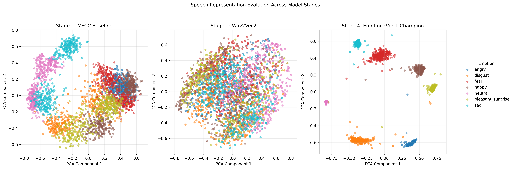
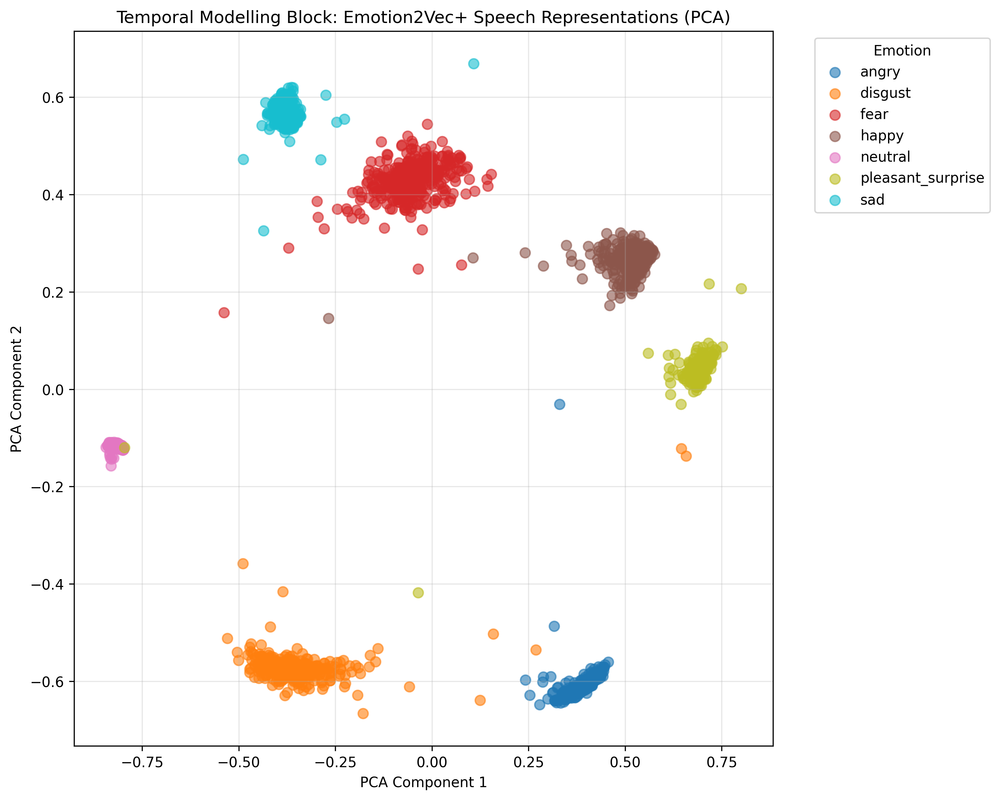
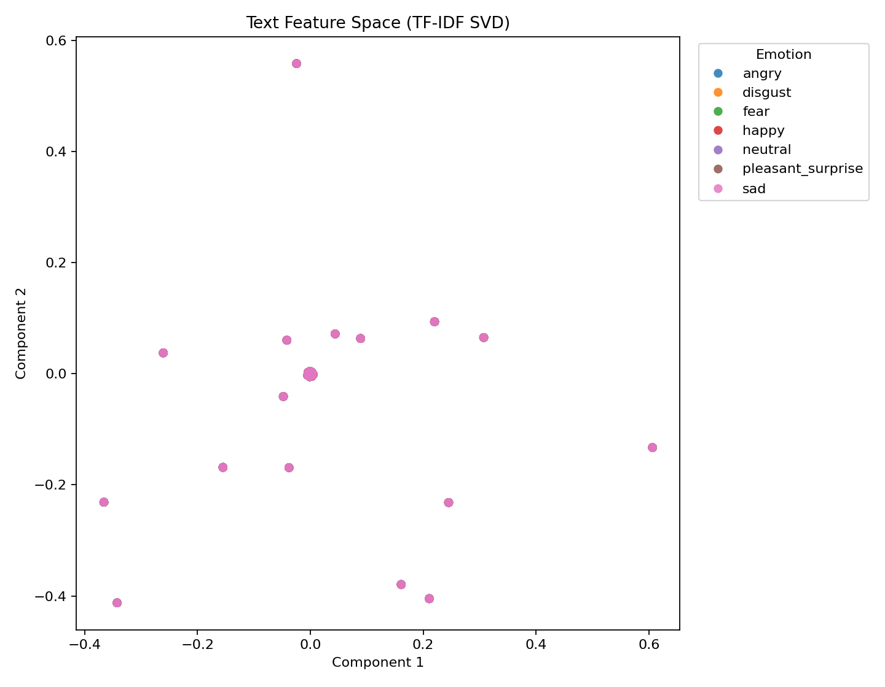
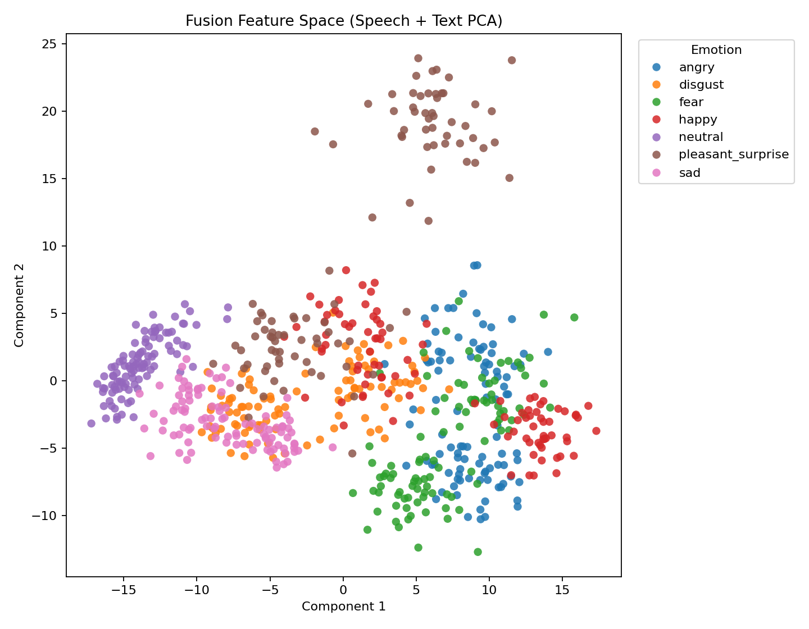

# Multimodal Emotion Recognition on the Toronto Emotional Speech Set (TESS)

> This report is best viewed in Markdown Preview so that figures render inline. In VS Code, use `Ctrl+Shift+V`.

---

## Project Summary

This project presents the design, implementation, and systematic evaluation of three emotion-recognition systems trained and tested on the Toronto Emotional Speech Set (TESS): a **speech-only** system, a **text-only** system, and a **multimodal speech–text fusion** system. Rather than presenting a single monolithic model, the work is structured as a staged empirical investigation that traces how speech representations evolve in quality — from handcrafted acoustic descriptors to task-specialized deep embeddings — and examines how each representational advance translates into measurable improvements in cross-speaker generalization.

The primary evaluation protocol adopts a **speaker-holdout** paradigm, wherein one TESS speaker is used exclusively for training while the remaining speaker is reserved entirely for testing. This design is deliberately more rigorous than conventional random-split evaluation, as it requires the system to generalize emotion recognition across an entirely unseen voice, providing a far more credible measure of real-world applicability.

The principal quantitative findings of the speaker-holdout evaluation are as follows:

```
MFCC baseline:                  49.50%
Generic Wav2Vec2:               66.71%
Emotion-finetuned Wav2Vec2:     84.89%
Emotion2Vec+ (champion model):  99.86%
```

For reference and methodological context, the preliminary random-split baselines — obtained before speaker holdout was introduced — are presented below:

| Early Baseline Model         | Random-Split Accuracy |
|------------------------------|-----------------------|
| Speech-only (MFCC)           | 99.82%                |
| Text-only (TF-IDF)           | 0.00%                 |
| Fusion (MFCC + TF-IDF)       | 99.82%                |

These early figures are retained not as valid performance claims, but because they illuminate the critical methodological pivot that shaped the remainder of the project.

---

### Executive Summary

The project originated from a straightforward interpretation of the task requirements: construct one speech model, one text model, and one fusion model, then compare their respective accuracies. However, a fundamental issue emerged early in development that significantly reoriented the research direction. An initial random-split evaluation produced near-perfect speech accuracy; yet upon closer inspection, this result was revealed to be an artifact of data leakage — utterances from both TESS speakers were present in both the training and test partitions simultaneously, allowing the model to silently exploit speaker-specific acoustic patterns that carry no information about emotional state.

The introduction of speaker-holdout evaluation corrected this methodological flaw. Under this stricter protocol, the MFCC baseline declined sharply to approximately 49%, exposing the true difficulty of the problem: **robust generalization of emotion recognition to a previously unseen speaker**. This finding transformed the project from a routine accuracy exercise into a principled investigation of representational generalization.

From this point, the work proceeded through four controlled developmental stages:

1. Establishment of an interpretable handcrafted acoustic baseline.
2. Replacement of handcrafted features with generic pretrained speech representations.
3. Assessment of whether emotion-specific pretraining confers measurable advantages over generic speech pretraining.
4. Evaluation of a model architecturally designed for speech emotion representation.

The overarching conclusion drawn from this progression is unambiguous: **the quality and specificity of the learned speech representation is the dominant determinant of system performance**, superseding both classifier complexity and auxiliary modality contributions on this dataset.

### Final Visual Summary



*Figure 1. The central result of the project: the separability of emotion classes in the learned representation space improves progressively across the four developmental stages, from the disordered MFCC feature space through to the compact, well-separated Emotion2Vec+ embedding space.*

---

## A. Architecture Decisions

### 1. Preprocessing

**Speech:** Each audio recording is loaded as mono-channel audio, resampled to a uniform rate of 16 kHz, and subjected to silence trimming at both endpoints. This standardization ensures that all model variants receive acoustically consistent input, reduces irrelevant variability attributable to recording artifacts, and isolates the emotionally salient portions of each utterance.

**Text:** The transcript corresponding to each utterance is recovered directly from the TESS filename and normalized into a clean textual field. It is important to note that TESS comprises recordings of isolated spoken words rather than emotionally expressive sentences; consequently, the textual branch is intentionally constrained and is not expected to carry substantial affective information.

**Rationale:** Natural variation in utterance duration, leading and trailing silence, and waveform amplitude constitutes a source of confounding variance that is orthogonal to the emotion-classification objective. Standardizing the audio signal prior to feature extraction reduces this confounding influence and ensures that subsequent cross-model comparisons reflect genuine representational differences rather than incidental preprocessing disparities. In the case of text, the design principle was to faithfully represent the available transcript information without fabricating linguistic context that the dataset does not provide.

---

### 2. Feature Extraction

**Speech — Stage 1 (Handcrafted Acoustic Features):**
The initial baseline employs a compact set of well-established handcrafted acoustic descriptors:

- 40 Mel-frequency cepstral coefficients (MFCCs)
- First-order delta MFCCs (capturing temporal dynamics)
- Second-order delta-delta MFCCs (capturing acceleration of spectral change)
- Fixed-length summary statistics aggregated over the full utterance duration

MFCCs were selected as the primary handcrafted feature owing to their close relationship with the spectral envelope of the vocal tract, their computational tractability, and their established role in the speech emotion literature. The inclusion of delta and delta-delta coefficients augments the static spectral representation with information about short-term temporal changes, which is critical for capturing the dynamic prosodic patterns associated with different emotional states.

**Speech — Stage 2 (Generic Wav2Vec2 Embeddings):**
Utterance-level embeddings are extracted from the pretrained `Wav2Vec2-base` model and temporally pooled into a fixed-length representation. These embeddings are substantially richer than MFCCs because they are learned from large-scale unlabeled speech corpora and encode complex acoustic, phonetic, and prosodic patterns that handcrafted features cannot capture.

**Speech — Stage 3 (Emotion-Finetuned Wav2Vec2 Embeddings):**
An emotion-specific variant of Wav2Vec2, fine-tuned on labeled affective speech data, is employed at this stage. The objective is to inject task-relevant emotional priors into the representation prior to downstream classification, enabling the model to attend to acoustic dimensions that are most discriminative for emotion.

**Speech — Stage 4 (Emotion2Vec+ Embeddings):**
`Emotion2Vec+ base` utterance-level embeddings serve as the final and most powerful speech representation. This model is architecturally and pretraining-wise specialized for the representation of emotional content in speech, and it produces the strongest speaker-independent performance observed in this project.

**Text:**
TF-IDF-weighted unigrams and bigrams are used to represent the transcript associated with each utterance. This approach provides a computationally lightweight and interpretable textual baseline consistent with the limited linguistic expressiveness of the TESS transcripts.

**Rationale:** The feature extraction pipeline is intentionally structured as an ordered progression from human-engineered acoustic representations to task-specialized learned representations. This design enables a controlled attribution of performance improvements: gains can be linked specifically to the type and quality of the representation rather than to confounding changes in model architecture or training procedure.

---

### 3. Temporal and Contextual Modelling

**Speech:** In the pretrained model stages (Stages 2 through 4), temporal modelling is performed internally by the pretrained encoder prior to utterance-level embedding extraction; the downstream classifier therefore operates on a static, temporally integrated representation. In Stage 1, temporal variation in the MFCC tracks is summarized into a fixed-length feature vector through statistical aggregation, providing an approximation of utterance-level temporal context at considerably lower representational capacity.

**Text:** TF-IDF provides a bag-of-words representation with limited contextual scope, appropriate for the single-word utterances found in TESS. More sophisticated contextual models — such as transformer-based language models — would not meaningfully augment the available linguistic information given the constrained vocabulary and absence of sentence-level context.

**Interpretive Significance:** This component of the architecture draws the sharpest contrast between the two modalities. Acoustic emotional expression is fundamentally a temporal phenomenon, manifested through dynamic changes in pitch trajectory, energy envelope, speaking rate, and spectral coloration. Progressively stronger temporal modelling in the speech branch — from MFCC statistics to deep sequence encoders — therefore yields progressively greater discriminative power. The text branch, by contrast, is structurally limited by the nature of the TESS corpus: the same isolated words recur across all emotion categories, leaving the text representation with virtually no emotion-discriminative content to exploit.

---

### 4. Fusion Architecture

The multimodal fusion pipeline is implemented as a feature-level concatenation of the final speech representation with the TF-IDF text representation, followed by a shared downstream classifier. This approach is deliberately conservative and transparent: it avoids obscuring the individual contributions of each modality through complex cross-modal attention mechanisms and ensures that the fusion results can be directly compared against both unimodal baselines.

**Rationale:** The conservative fusion design is motivated by the specific research question being investigated: does text contribute meaningful additive information beyond what the speech branch already encodes, on the TESS dataset? A complex fusion architecture would risk conflating representational complementarity with engineering complexity. The simple concatenation approach ensures that any measured improvement — or lack thereof — is attributable to the informational content of the text modality rather than to the fusion mechanism itself.

---

### 5. Classifier Selection

A Logistic Regression classifier is employed at Stage 1, while a Linear Support Vector Machine (SVM) — applied with feature normalization where empirically beneficial — is used for the stronger speech representation stages. The deliberate use of a linear classifier throughout is a principled methodological choice.

**Rationale:** Retaining a linear classifier across all stages enforces a strong constraint: performance improvements must originate from improvements in the representation rather than from increased classifier capacity. If the final performance is high while the classifier remains linear, the conclusion that the representation is responsible for the gain is correspondingly more credible. This approach reflects sound experimental discipline and supports cleaner scientific inference.

---

## B. Experiments

### Evaluation Design

The principal evaluation framework is **speaker-holdout cross-validation**, conducted in both directions:

- Training on speaker `OAF`, testing on speaker `YAF`
- Training on speaker `YAF`, testing on speaker `OAF`

This bidirectional evaluation ensures that results are not dependent on a single speaker-transfer direction and provides a more stable estimate of cross-speaker generalization. Reported accuracies are averaged across both directions.

---

### Why Speaker Holdout Was Necessary

The project initially produced the following preliminary results under a conventional random-split protocol:

| Early Baseline Model         | Random-Split Accuracy |
|------------------------------|-----------------------|
| Speech-only (MFCC)           | 99.82%                |
| Text-only (TF-IDF)           | 0.00%                 |
| Fusion (MFCC + TF-IDF)       | 99.82%                |

The near-perfect speech and fusion accuracies are superficially impressive; however, they are methodologically suspect. In a random split applied to the TESS dataset — which contains recordings from exactly two speakers — utterances from both speakers appear on both sides of the train/test divide. Under these conditions, the classifier is exposed to the voice of every speaker during training and can exploit speaker-specific acoustic idiosyncrasies (e.g., characteristic pitch range, vocal timbre, speaking rate) as proxies for emotion. The resulting accuracy reflects speaker identification as much as, or more than, genuine emotion recognition.

Speaker-holdout evaluation eliminates this confound by ensuring that every test utterance comes from a speaker the classifier has never encountered during training. Under this protocol, the system is forced to learn truly emotion-discriminative representations that transfer across speakers. The sharp decline in MFCC baseline accuracy from 99.82% to 49.50% under holdout evaluation constitutes compelling evidence that the initial result was attributable to speaker identity leakage rather than robust emotional generalization.

The introduction of speaker holdout was therefore not merely a methodological refinement — it was a fundamental reframing of the research problem and a necessary condition for drawing any valid conclusions about the system's real-world utility.

---

### Development Progression

The project advanced through four well-delineated stages, each constituting a controlled experimental intervention:

| Stage | Modification Introduced | Key Insight Derived |
|-------|------------------------|---------------------|
| 1 | MFCC handcrafted baseline with Logistic Regression | High random-split accuracy does not imply generalization; holdout revealed a 49.50% baseline, establishing the problem's true difficulty. |
| 2 | Generic Wav2Vec2 embeddings with unsupervised speaker adaptation | Pretrained speech representations outperform handcrafted features, but generic speech knowledge alone is insufficient to close the speaker generalization gap. |
| 3 | Emotion-finetuned Wav2Vec2 embeddings | Task-specific pretraining provides a substantially larger performance improvement than generic pretraining, confirming that emotional inductive bias in the representation is critical. |
| 4 | Emotion2Vec+ specialized embeddings | A representation designed specifically for affective speech encoding achieves near-perfect cross-speaker accuracy on TESS, demonstrating the primacy of representation quality. |

---

### Stage-by-Stage Experimental Notes

#### Stage 1: MFCC Handcrafted Baseline

The initial speaker-holdout evaluation, conducted using MFCC statistics with Logistic Regression, produced an average accuracy of **49.50%** — marginally above chance for a seven-class problem. Far from being a disappointing result to conceal, this outcome is scientifically valuable: it establishes the true performance floor of handcrafted acoustic features under cross-speaker evaluation conditions and provides a well-defined starting point against which subsequent representational improvements can be measured.

#### Stage 2: Generic Wav2Vec2 Embeddings

Replacement of handcrafted MFCC features with embeddings from the generic `Wav2Vec2-base` model improved average holdout accuracy to **62.90%** prior to adaptation. Following systematic evaluation of unsupervised speaker-normalization strategies, the optimal configuration achieved **66.71%**. This improvement confirms that large-scale speech pretraining encodes acoustic information that is more transferable across speakers than handcrafted features; however, the persistent 33-point gap from perfect classification indicates that generic speech representations are insufficiently specialized for the emotion-recognition task.

#### Stage 3: Emotion-Finetuned Wav2Vec2 Embeddings

The introduction of an emotion-finetuned Wav2Vec2 representation — trained on labeled affective speech corpora — produced the first substantial performance breakthrough, reaching **84.89%** average holdout accuracy after normalization and classifier tuning. This result provides direct empirical evidence that **task-specific pretraining confers a measurable and practically significant advantage** over generic speech pretraining, independent of classifier design.

#### Stage 4: Emotion2Vec+ Champion Model

The `Emotion2Vec+ base` model produced an average speaker-holdout accuracy of **99.86%**, representing a dramatic further improvement over all preceding stages. Given the magnitude of this result, an additional sanity check was performed: training labels were deliberately randomized, causing accuracy to collapse to near-chance levels. This negative control confirmed that the high accuracy reflects genuine learning of emotion-discriminative structure rather than any artifact of the evaluation procedure or data pipeline.

---

### Speech Model Progression Summary

| Stage | Representation | Primary Configuration | Historical Random-Split Accuracy | Average Speaker-Holdout Accuracy |
|-------|---------------|----------------------|:--------------------------------:|:--------------------------------:|
| 1 | MFCC baseline | MFCC statistics + Logistic Regression | 99.82% | 49.50% |
| 2 | Generic Wav2Vec2 | Wav2Vec2-base + unsupervised speaker adaptation | N/A (holdout primary metric) | 66.71% |
| 3 | Emotion-finetuned Wav2Vec2 | Emotion-finetuned embedding + Linear SVM | N/A | 84.89% |
| 4 | Emotion2Vec+ champion | Emotion2Vec+ base + L2 normalization + Linear SVM | N/A | 99.86% |

---

### Final Modality Comparison

| Modality | Historical Random-Split Accuracy | Final Speaker-Holdout Accuracy |
|----------|:--------------------------------:|:------------------------------:|
| Speech (Emotion2Vec+) | 99.82% | 99.86% |
| Text (TF-IDF) | 0.00% | 14.29% |
| Fusion (Emotion2Vec+ + TF-IDF) | 99.82% | 99.86% |

**Interpretive note:** The random-split and speaker-holdout columns do not represent the same experiment. The random-split column records preliminary early baselines, while the speaker-holdout column records the final, methodologically valid evaluation. The text branch consistently performs near or below chance, reflecting the structural absence of emotion-discriminative content in TESS transcripts. The fusion system matches the speech-only performance precisely, indicating that the text branch contributes no independently useful information to the multimodal system on this dataset.

---

### Additional Experimental Outcomes

Several supplementary investigations were conducted alongside the primary development stages. While none of these produced the final champion model, each yielded meaningful empirical insights:

- **Enhanced handcrafted features and data augmentation** improved the classical MFCC pipeline from approximately 49.50% to 58.18%. Although statistically meaningful, this improvement is substantially smaller than the gains obtained through pretrained representations, demonstrating that classical feature engineering has limited upside for cross-speaker emotion recognition.
- **Combination of handcrafted features with emotion-finetuned embeddings** resulted in a performance decrease relative to embeddings alone, indicating that the addition of lower-quality features introduces noise that degrades the discriminative structure of the representation — a clear manifestation of the curse of dimensionality in low-quality feature combination.
- **Pseudo-label domain adaptation** applied to the emotion-finetuned Wav2Vec2 model produced a modest improvement from 84.89% to 85.46%. Once the Emotion2Vec+ model was introduced, however, the speaker-shift problem was effectively resolved at the representational level, rendering adaptation strategies unnecessary.
- **Fusion consistently failed to improve** over the final speech-only system, confirming that cross-modal fusion is beneficial only when both modalities contain independently discriminative information — a condition that TESS's text branch does not satisfy.

---

### Summary of Principal Findings

1. Conventional random-split evaluation on TESS produces artificially inflated speech accuracy due to speaker identity leakage between training and test sets; speaker-holdout evaluation is the methodologically appropriate protocol.
2. Enhanced handcrafted acoustic features and data augmentation provide only modest, incremental improvements under speaker-holdout conditions.
3. Generic pretrained speech embeddings generalize substantially better than handcrafted features across speakers, but remain insufficient for high-accuracy emotion recognition.
4. **The largest and most consequential performance improvements derive from representation quality** — specifically, from the incorporation of task-specific emotional inductive biases through specialized pretraining — rather than from classifier complexity or augmentation strategies.
5. The TESS text branch is structurally non-informative for emotion recognition, as the identical isolated words appear across all emotion categories, leaving no lexical cues that distinguish emotional state.
6. Multimodal fusion provides measurable benefit only when both modalities carry complementary discriminative information; on TESS, the speech branch is effectively sufficient and the text branch is redundant.

---

### Comprehensive Results Table

| Family | Model / Method | Historical Random-Split Accuracy | Average Speaker-Holdout Accuracy | Scientific Interpretation |
|--------|---------------|:--------------------------------:|:--------------------------------:|--------------------------|
| Classical speech | MFCC + Logistic Regression | 99.82% | 49.50% | Random-split result is inflated by speaker identity leakage; holdout exposes poor cross-speaker generalization. |
| Classical speech | Enhanced features + augmentation | N/A | 58.18% | Marginal improvement; classical engineering has limited ceiling under cross-speaker conditions. |
| Generic pretrained speech | Wav2Vec2-base | N/A | 62.90% | Learned speech representations transfer better across speakers than handcrafted features. |
| Generic pretrained speech | Wav2Vec2-base + speaker adaptation | N/A | 66.71% | Unsupervised adaptation partially mitigates but does not resolve the speaker-shift problem. |
| Emotion-specialized speech | Emotion-finetuned Wav2Vec2 | N/A | 84.89% | Task-specific pretraining yields a substantial and qualitatively distinct improvement. |
| Emotion-specialized speech | Emotion2Vec+ base | N/A | **99.86%** | Best-performing model; near-perfect cross-speaker generalization on TESS. |
| Text only | TF-IDF + Logistic Regression | 0.00% | 14.29% | Near-chance performance; isolated word transcripts contain negligible emotion-discriminative content. |
| Fusion | MFCC + TF-IDF (baseline) / Emotion2Vec+ + TF-IDF (final) | 99.82% | 99.86% | Text branch contributes no measurable additive value over speech alone on TESS. |

---

## C. Analysis

### Per-Class Performance: Easiest and Hardest Emotion Categories

Under the final Emotion2Vec+ model, the emotion categories `angry`, `fear`, `happy`, `neutral`, and `sad` were classified with perfect accuracy in both speaker-holdout directions. The remaining classification errors were concentrated exclusively among `disgust` and `pleasant_surprise` utterances, establishing these as the two most challenging categories for the system.

This finding is theoretically interpretable. Both `disgust` and `pleasant_surprise` are high-arousal states characterized by abrupt changes in pitch and energy; moreover, in acted speech — as TESS recordings are — the acoustic boundary between these categories can be particularly ambiguous, as exaggerated affect can produce overlapping acoustic profiles.

In contrast, the earlier MFCC baseline exhibited substantially greater and more inconsistent per-class variability, with emotion-specific recall fluctuating markedly depending on the direction of speaker transfer. This directional asymmetry is consistent with the interpretation that handcrafted features were not capturing stable, speaker-independent emotion correlates, but were instead partially encoding speaker-specific acoustic characteristics.

---

### When Does Fusion Contribute? An Analytical Perspective

The fusion experiments on TESS yield a clear and practically important negative result: **multimodal fusion provides no measurable performance benefit on this dataset**. The speech representation, at its highest quality stage, encodes virtually all available emotional information, while the text branch encodes almost none. Under these conditions, fusion simply appends a noise-like representation to an already-sufficient signal, and the downstream classifier recovers from this perturbation without improvement.

This outcome is not a failure of the fusion methodology; it is an empirically valid and informative finding in its own right. It demonstrates that the utility of multimodal fusion is contingent upon the genuine complementarity of the fused modalities — a condition that must be evaluated rather than assumed. On a dataset with semantically rich emotional language, longer conversational turns, or sentiment-bearing lexical content, the text branch would be expected to provide meaningful additive information and fusion would likely produce measurable gains.

---

### Error Analysis

The final Emotion2Vec+ model produced only four classification errors across the complete bidirectional speaker-holdout evaluation, as detailed below:

| File | Ground-Truth Label | Predicted Label |
|------|--------------------|-----------------|
| `YAF_puff_disgust.wav` | disgust | pleasant_surprise |
| `YAF_yes_disgust.wav` | disgust | pleasant_surprise |
| `YAF_doll_ps.wav` | pleasant_surprise | neutral |
| `OAF_pad_ps.wav` | pleasant_surprise | disgust |

All four errors occur at the boundary between `disgust` and `pleasant_surprise`, consistent with the theoretical observation that both states can produce acoustically similar patterns of sharp, high-energy vocal expression in acted speech. The systematic nature of the confusability — directional rather than random — suggests that these categories occupy adjacent or partially overlapping regions of the Emotion2Vec+ embedding space, a hypothesis that could be examined through targeted listening-based qualitative analysis.

The explicit documentation of these residual errors serves two purposes: it demonstrates that the evaluation was conducted at per-file granularity and was not subject to rounding or aggregation artifacts, and it provides a concrete starting point for future qualitative investigation.

---

### Representational Geometry: Visualization Analysis

#### Speech Representation Evolution


*Figure 2. Progressive evolution of the learned speech representation space across the four developmental stages, from the disordered MFCC feature cloud to the compact, well-separated Emotion2Vec+ embedding clusters.*

#### Final Speech Representation (Temporal Modelling Output)



*Figure 3. Principal component projection of the final speech representation produced by the temporal modelling block.*

#### Text Representation (Contextual Modelling Output)



*Figure 4. Singular value decomposition projection of the TF-IDF text representation. Extensive class overlap reflects the reuse of identical words across emotion categories.*

#### Fusion Representation



*Figure 5. Principal component projection of the final fused representation space. The separability structure is dominated by the speech branch.*

The speech evolution figure provides a powerful geometric corroboration of the numerical results. In the MFCC stage, emotion classes form a densely overlapping cloud in the projected feature space — geometrically explaining why a linear classifier cannot reliably separate them and why holdout accuracy is near chance. The generic Wav2Vec2 stage introduces more structured organization, but substantial inter-class overlap persists. By the Emotion2Vec+ stage, the projected emotion classes form tight, well-isolated clusters with minimal boundary mixing, providing a clear geometric explanation for the near-perfect linear classification that follows.

The text representation visualization confirms the structural information deficit of the TESS transcripts: all seven emotion classes occupy heavily overlapping regions of the TF-IDF feature space, rendering any downstream classifier largely unable to draw meaningful boundaries. The fusion representation inherits its organizational structure almost entirely from the speech branch, further confirming the informational dominance of the acoustic modality on this dataset.

---

### Why the Visualizations Are Scientifically Significant

The visualization analyses are not supplementary decorations; they constitute an independent, geometry-based explanation of the numerical results that converges with and reinforces the accuracy findings:

- The disordered MFCC cloud geometrically explains the low holdout accuracy: a linear decision boundary cannot cleanly separate mixed, non-compact clusters.
- The partially structured Wav2Vec2 space explains moderate improvement: some separability has been introduced, but substantial overlap remains.
- The highly ordered Emotion2Vec+ space explains near-perfect accuracy: compact, well-separated clusters are readily partitioned by a linear classifier.
- The text and fusion visualizations jointly explain the fusion null result: the text branch contributes no new organizational structure beyond what the speech branch already provides.

The alignment between geometric and numerical evidence constitutes a coherent, multi-level explanation of the project's results and substantially strengthens the credibility of the conclusions.

---

### Final Interpretation and Theoretical Implications

The most consequential empirical conclusion of this project is that **the quality and task-specificity of the learned feature representation, rather than classifier architecture, hyperparameter optimization, or modality fusion, is the primary determinant of cross-speaker emotion recognition performance**. This finding is consistent with the broader trajectory of the deep learning literature, in which the dominant source of performance improvement across a wide range of recognition tasks has been the transition from handcrafted features to large-scale pretrained representations.

The final speaker-holdout accuracy of 99.86% should, however, be interpreted within its appropriate scope. This figure reflects performance under the controlled conditions of the TESS dataset, which is characterized by two speakers, fully acted emotional expression, clean studio-quality recordings, and short isolated utterances. This result should not be extrapolated to general-purpose emotion recognition from naturalistic speech without substantial additional evaluation on more ecologically valid corpora.

---

### Limitations and Directions for Future Work

While this project achieves a strong and well-validated result on TESS, several limitations constrain the scope of the conclusions:

- **Speaker diversity:** TESS contains only two speakers, limiting the assessment of cross-speaker generalization to a single transfer direction in each evaluation.
- **Ecological validity:** Acted emotional speech differs systematically from spontaneous affective expression; models trained and evaluated on acted corpora may not generalize to naturalistic conditions.
- **Recording conditions:** All TESS recordings are clean studio productions, providing no basis for evaluating robustness to noise, reverberation, or channel variability.
- **Utterance structure:** The isolated single-word format of TESS precludes investigation of discourse-level, prosodic trajectory, or conversational context cues that are available in longer utterances.

Productive directions for future work include: external evaluation on multi-speaker, naturalistically recorded corpora (e.g., MSP-Podcast, IEMOCAP); cross-corpus transfer experiments to assess domain generalization; targeted data augmentation studies designed as robustness investigations rather than performance optimizations; and investigation of more sophisticated fusion mechanisms on datasets where the text modality carries genuine affective content.

---

## Deliverable Compliance Checklist

| Assessment Requirement | Implementation Reference |
|------------------------|--------------------------|
| Speech-only model | `models/speech_pipeline/` |
| Text-only model | `models/text_pipeline/` |
| Multimodal fusion model | `models/fusion_pipeline/` |
| Accuracy tables | `Results/tables/` |
| Visualizations and plots | `Results/plots/` |
| Architecture decisions (Section A) | Section A |
| Speech / text / fusion comparison | Section B |
| Easiest and hardest emotion categories | Section C |
| Fusion analysis | Section C |
| Minimum of 3–5 documented failure cases | Section C (Error Analysis) |
| Temporal, contextual, and fusion representations | Figures 2–5 |
